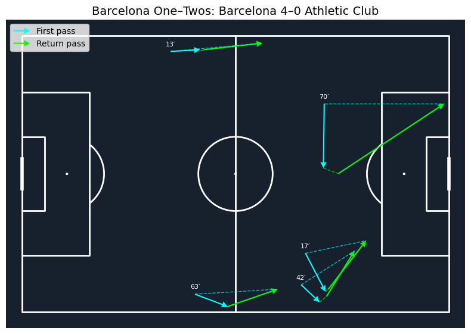
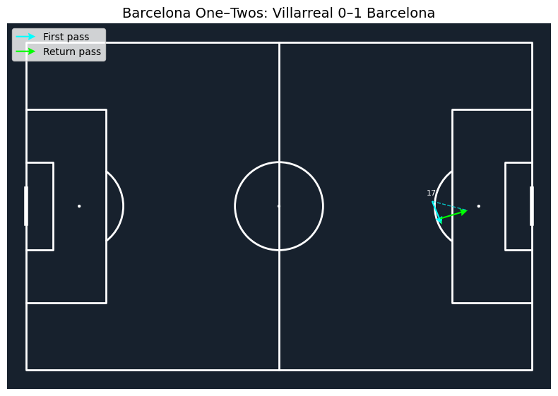
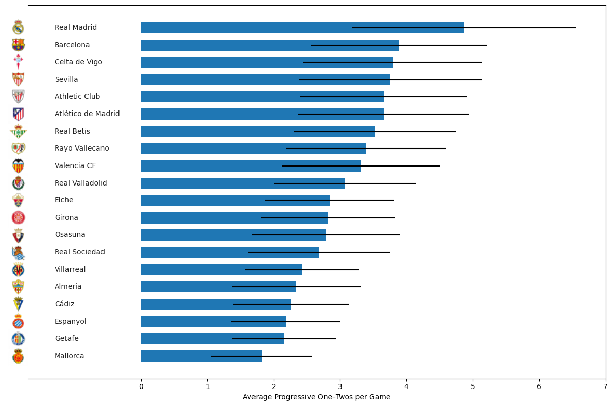
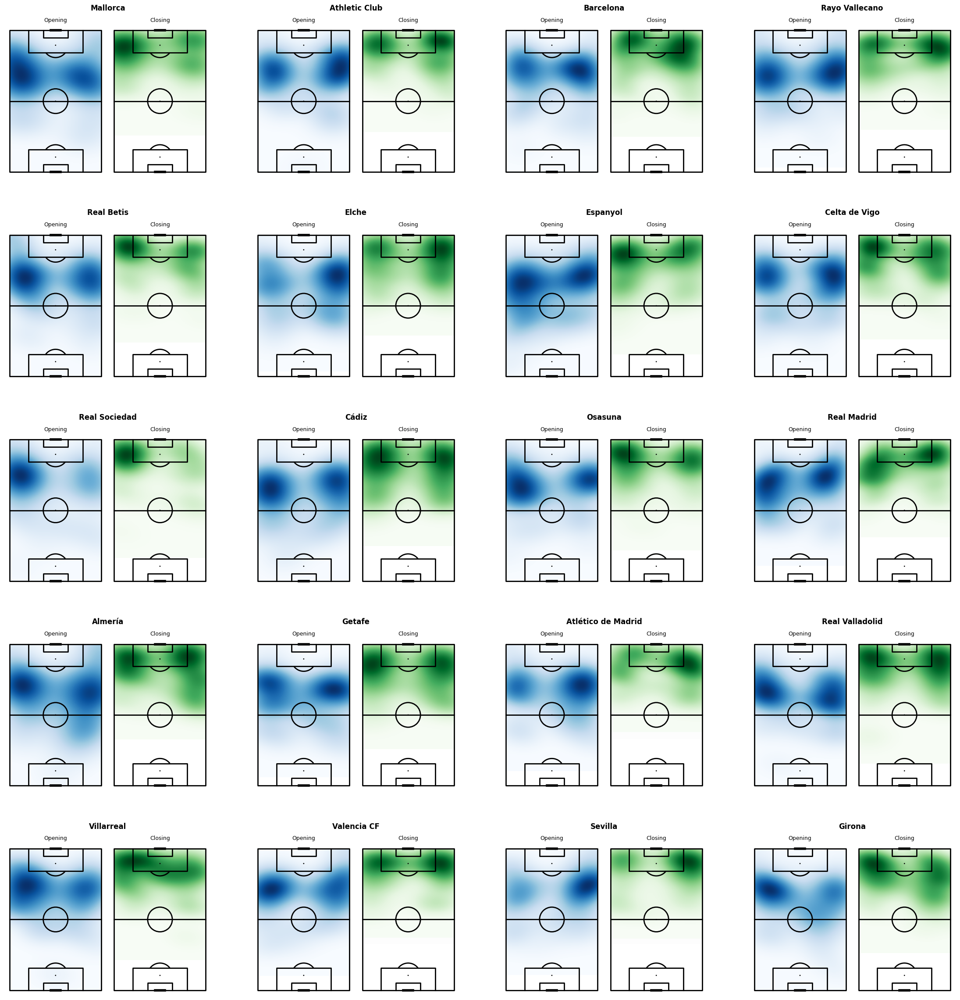
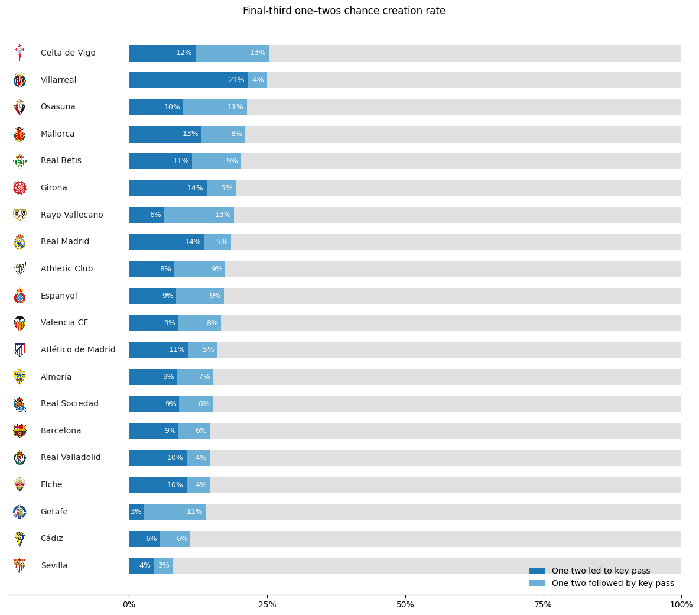
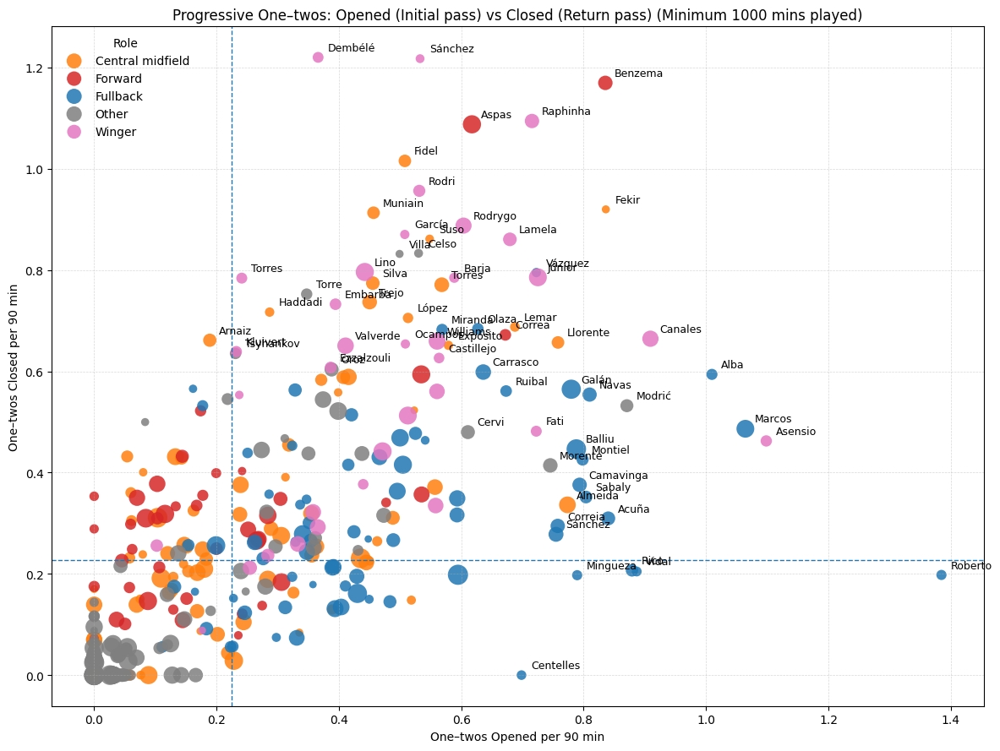
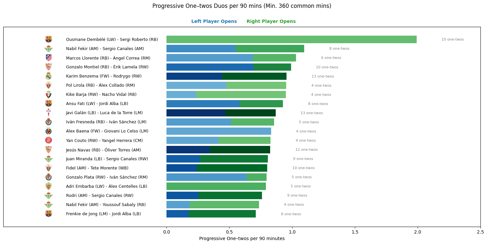

# Association-metrics : Progressive One twos
Identifying progressive one twos and quantifying player and team involvement, using Opta F24 event data (La Liga 22/23 season).

# Progressive one twos metric definition:

###
* Rules:

Check `soccer_one_twos_extractor/metrics/association_metrics.py` for more details

1. Completed pass A→B followed
immediately by a completed pass B→A (Same team & period).

2. Progressive: (either `prog_goal_center` (progression towards goal center) or `prog_goal_line` (progression towards goal line) ≥
`min_progression_ratio_pct`)

3. Happens quickly:

- (`Δt` ≤ `max_time_diff` seconds): `Δt` defined as the difference between one two's opening time and one two's closing time

- Small Carry distance, One two's closer shouldn't move too far before returning the ball
(`receiver_carry_distance` ≤ `max_player_b_ball_carry_distance`).

# La liga 2022 2023 Opta F24 Data Analysis :

## Team analysis

### Prog. One twos preview
- Barcelona Prog. One two's Vs Bilbao:

- Pedri's Goal against Villareal:

### 1. Average Prog. One twos per Game Ranking

### 2. Prog. One twos Spatial distribution

### 3. Prog. One twos chance conversion rate in Final third

## Player Analysis
### 1. Prog. One twos Players involvement

### 2. Prog. One twos Duos involvement

